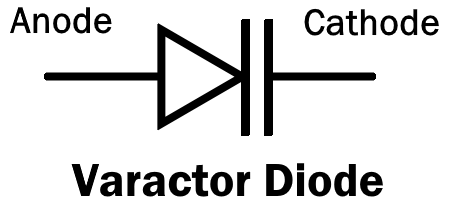
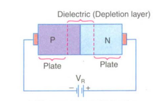
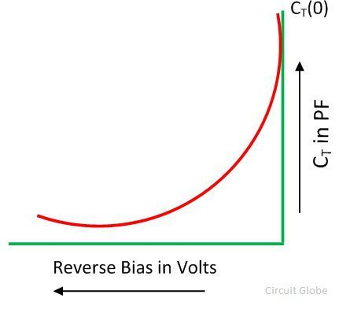

# Analogue Electronics II

## 1. Special Semiconductor Devices

### Varactor Diode

A reverse-biased PN junction which utilizes the inherent capacitance of the depletion layer. Its internal capacitance varies with the variation of the reverse voltage. Also known as a varicap, voltcap, Voltage variable capacitor, or tunning diode. It is used as a voltage variable capacitor. 

The output of the diode depends on the input voltage. The varactor diode is used in a place where a variable capacitance is required, and that capacitance is controlled with the help of the voltage. 

The depletion layer created by reverse biasing a PN junction acts as a capacitor dielectric while the P- and N- regions act as capacitor plates.

#### Working of a varactor Diode

The Varactor diode is made up of n-type and p-type semiconductor material. In an n-type semiconductor material, the electrons are the majority charge carrier and in the p-type material, the holes are the majority carriers. When the p-type and n-type semiconductor material are joined together, the p-n junction is formed, and the depletion region is created at the PN-junction. The positive and negative ions make the depletion region. This region blocks the current from flowing through the PN junction.

#### Characteristics of Varactor Diode

When the reverse bias voltage increases, the depletion layer widens. This increases the dielectric thickness and reduces the capacitance. When the reverse bias voltage decreases, the dielectric thickness reduces, which in turn, increases the capacitance.

The capacitance is maximum when the reverse voltage is zero, and reduces in a non-linear manner as the reverse voltage is increased.

#### Applications
1. Tuning

### Unijunction Transistor (UJT)
 A 3 terminal semiconductor switching device. Has only one PN junction like an ordinary diode, but has three terminals. 

#### Basic Construction

 Consists of an N-type silicon semiconductor bar and a P-type silicon region. N-type bar is called base while the P-type region is the emitter.

The emitter region is heavily doped while the base region is lightly doped so that the resistivity of the base material is very high.

Three terminals are taken out of the whole structure: one from the emitter, two from the base material, with the emitter(E) being close to base 2(B2), than to base 1(B1).

Symbol of UJT is different from JFET in that the arrow is at some angle in the schematic symbol of UJT

#### Equivalent Circuit of UJT

- The resistance of silicon bar is called as the inter-base resistance (has a value from 4 kΩ to 10 kΩ).
- The resistance RB1 is the resistance of the bar between emitter and B1 region. The value of this is variable and depends upon the bias voltage across the pn-junction.
- The resistance RB2 is the resistance of the bar between emitter and B2 region.
- The emitter pn-junction is represented by a diode.

With no voltage applied to the UJT, the value of inter-base resistance is given by:

**RBB = RB1 + RB2**

The intrinsic stand-off ration (ƞ) of UJT is given by

**η=V1/VBB = RB1/(RB1+RB2)**

The voltage across RB1 is:

**V1 = RB1/(RB1+RB2) VBB = ηVBB**

The value of ~ƞ~ generally lies between 0.51 and 0.82.

The Peak Point Voltage (Vp) of the UJT is:

**Vp=ηVBB+VD**

#### Operation of UJT
Peak Point Voltage (Vp)  is the value of emitter voltage which causes the diode to conduct. At this point the UJT is said to be fired, triggered or ON. Holes from the P-type emitter are injected into the base region and are swept by the electric field into the base terminal B1. The presence of excess holes slightly reduces resistance Rb1 which in turn reduces the intrinsic stand-off voltage **ηVBB. This action is called conductivity modulation since conductivity of the material between emitter and base increases as the holes are injected into it. It is a regeneretive process because a smaller value of V1 results in a stronger forward bias across the diode which in turn lead to more hole being injected into the base and V1 is further reduced. As a result of this, the emitter current increases, but Ve reduces.

With any value of emitter voltage below (Vp), the diode is reverse biased with a voltage equal to

#### VI Characteristics of UJT

There are 2 important points on the curve: (1)peak point and (2)valley point. They divide the curve into 3 regions: cut-off, negative resistance and saturation regions

1. Cut-off region: The emitter voltage (VE) is below Vp and emitter current is approximately zero. The UJT is in its OFF position.

2. Negative resistance region: Ve reduces from Vp to Vv and emitter current increases from Ip to Ip. The increase in emitter current is due to the decrease in resistance RB1. When the UJT is operated as an oscillator, it works in this region.

3. Saturation Region: The device is in its on position, VE remains almost constant with the increasing IE.

#### Applications of UJT

1. Switching Device
2. Triggering Device for Triacs and SCR’s
3. Timing Circuits
4. For phase control
5. In sawtooth generators
6. In simple  relaxation oscillators

#### Excercise

1. Determine the peak-point voltage (Vp) value for the 2N 4870 UJT shown. Take VD = 0.7 V.

1. Trigger device for Triacs and SCRs
2. Timing circuits
3. Sawtooth generators
4. Non-sinusoidal oscillators

### Programmable UJT (PUT)
A thyristor that has a function similar to that of a UJT, but the gate is connected to the anode of PN junction.

The functional difference between UJT and PUT is that PUT has an intrinsic stand-off ratio that is variable while UJT does not.

The characteristic curve for the programmable unijunction transistor is similar to that of the unijunction transistor. It is a plot of anode current IA versus anode voltage VA.

### Diac
A two terminal device which can pass current in either direction when then breakover voltage is reached in either polarity across the two terminals. Basic construction is simlar to that of a triac but without the base terminal.

A diac consists of 2 4-layer diodes connected in parallel but in opposite directions. From the figure these are P1N1P2N2 and P2N1P1N3

The terminal are designated by numbers instead of anode and cathode since it cconducts in both directions. The terminals are MT1 and MT2. 

When the applied voltage makes MT2 positive with respect to MT1,  the diac passes current through the diode P1N1P2N2.

#### VI Characteristics of DIAC

When a diac is operated with MT2 positive with respect to MT1, the VI characteristics is shown by the curve OAB. With MT2 Positive, the curve OCD.

This VI chacteristic gives us an info about the following points:
1. Curves OAB and OCD are symmetrical and identical.
2. The diac does not pass any current until the applied voltage of either polarity reaches the breakover voltage.
3. At the breakover voltage, the diac turns ON and the current through the diac increases rapidly.
4. The operating voltage and current are the same in either direction. Therefore the diac is a symmetrical bilateral diode.

### Silicon Controlled Switch (SCS)

Similar in constructon to an SCR, having 4 terminals: anode, cathode and two gate terminals called anode gate and cathode date. 

SCS can be turned ON and OFF using either gate terminal, but SCR can be turned ON only using its gate terminal, but cannot be turned OFF using the same gate terminal.

#### SCS Operation
#### SCS Applications

### Triac
p. 425

### Silicon Controlled Rectifier
p. 424

### Applications of Semi Conductor Devices