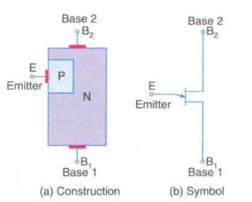

# Analogue Electronics II

## 1. Special Semiconductor Devices

### Varactor Diode

A reverse-biased PN junction which utilizes the inherent capacitance of the depletion layer. Its internal capacitance varies with the variation of the reverse voltage. Also known as a varicap, voltcap, Voltage variable capacitor, or tunning diode. It is used as a voltage variable capacitor. 

The output of the diode depends on the input voltage. The varactor diode is used in a place where a variable capacitance is required, and that capacitance is controlled with the help of the voltage. 

The depletion layer created by reverse biasing a PN junction acts as a capacitor dielectric while the P- and N- regions act as capacitor plates.

#### Working of a varactor Diode

The Varactor diode is made up of n-type and p-type semiconductor material. In an n-type semiconductor material, the electrons are the majority charge carrier and in the p-type material, the holes are the majority carriers. When the p-type and n-type semiconductor material are joined together, the p-n junction is formed, and the depletion region is created at the PN-junction. The positive and negative ions make the depletion region. This region blocks the current from flowing through the PN junction.

#### Characteristics of Varactor Diode

When the reverse bias voltage increases, the depletion layer widens. This increases the dielectric thickness and reduces the capacitance. When the reverse bias voltage decreases, the dielectric thickness reduces, which in turn, increases the capacitance.

The capacitance is maximum when the reverse voltage is zero, and reduces in a non-linear manner as the reverse voltage is increased.

#### Applications
1. Tuning

### Unijunction Transistor (UJT)
 A 3 terminal semiconductor switching device. Has only one PN junction like an ordinary diode, but has three terminals. 

 #### Basic Construction

 Consists of an N-type silicon semiconductor bar and a P-type silicon region. N-type bar is called base while the P-type region is the emitter.

The emitter region is heavily doped while the base region is lightly doped so that the resistivity of the base material is very high.

Three terminals are taken out of the whole structure: one from the emitter, two from the base material, with the emitter(E) being close to base 2(B2), than to base 1(B1).

Symbol of UJT is different from JFET in that the arrow is at some angle in the schematic symbol of UJT

#### Equivalent Circuit of UJT
#### Operation of UJT
#### VI Characteristics of UJT
#### Applications of UJT

1. Trigger device for Triacs and SCRs
2. Timing circuits
3. Sawtooth generators
4. Non-sinusoidal oscillators

