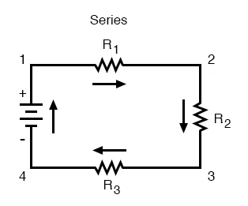
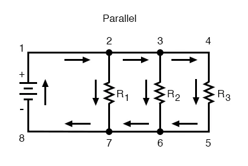
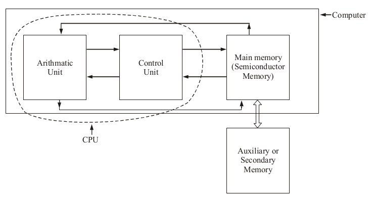

# Basic Electronics

## 1. Introduction to Electrical Circuits

### Basic Electrical Quantities and Their Units
1. Electromotive force - volts (V)
2. Current - Amperes (A)
3. Resistance - Ohms(Ω)
4. Power - Watts (W)
5. Energy - Joules (J)
6. Capacitance - Farads (F)
7. Inductance - Henrys (H)

## 2. Simple AC Circuits
## 3. Simple DC Circuits
### Passive Components
1. Resistors
2. Capacitors
3. Inductors
4. Battery

### Resistors in Series
The basic idea of a “series” connection is that components are connected end-to-end in a line to form a single path for electrons to flow.

### Resistors in Parallel
 The basic idea of a “parallel” connection, on the other hand, is that all components are connected across each other's leads.
 

### Series-Parallel Connection
 

### Resistivity of Metal Conductors

Electrical resistivity  is a fundamental property of a material that measures how strongly it resists electric current. A low resistivity indicates a material that readily allows electric current. Resistivity is commonly represented by the Greek letter ρ (rho). The SI unit of electrical resistivity is the ohm-meter (Ω⋅m).

Conductivity is the reciprocal of resistivity

## 4. Electronic Components

## 5. Semiconductor Theory

## 6. Memories

### Definition of Computer Memory

Computer Memory is a device that is used to store data or programs (sequences of instructions) on a temporary or permanent basis for use in an electronic digital computer. Computers represent information in binary code, written as sequences of 0s and 1s. Each binary digit (or “bit”) may be stored by any physical system that can be in either of two stable states, to represent 0 and 1. Such a system is called bistable. This could be an on-off switch, an electrical capacitor that can store or lose a charge, a magnet with its polarity up or down, or a surface that can have a pit or not. Previously, capacitors and transistors, functioning as tiny electrical switches, are used for temporary storage, and either disks or tape with a magnetic coating, or plastic discs with patterns of pits are used for long-term storage.

Computer memory is divided into 3:
1. Cache memory
2. ***main (or primary) memory*** and 
3. ***auxiliary (or secondary) memory***. Main memory holds instructions and data when a program is executing, while auxiliary memory holds data and programs not currently in use and provides long-term storage.

#### Cache Memory
Cache memory is a very high speed semiconductor memory which can speed up the CPU. It acts as a buffer between the CPU and the main memory. It is used to hold those parts of data and program which are most frequently used by the CPU. The parts of data and programs are transferred from the disk to cache memory by the operating system, from where the CPU can access them.

**Advantages**
The advantages of cache memory are as follows −
1. Cache memory is faster than main memory.
2. It consumes less access time as compared to main memory.
3. It stores the program that can be executed within a short period of time.
4. It stores data for temporary use.

**Disadvantages**
The disadvantages of cache memory are as follows −

1. Cache memory has limited capacity.
2. It is very expensive.

#### Primary Memory (Main Memory)
Primary memory holds only those data and instructions on which the computer is currently working. It has a limited capacity and data is lost when power is switched off. It is generally made up of semiconductor device. These memories are not as fast as registers. The data and instruction required to be processed resides in the main memory. It is divided into two subcategories RAM and ROM.

**Characteristics of Main Memory**
1. These are semiconductor memories.
2. Usually volatile memory.
3. Data is lost in case power is switched off.
4. It is the working memory of the computer.
5. Faster than secondary memories.
6. A computer cannot run without the primary memory.

#### Secondary Memory
This type of memory is also known as external memory or non-volatile. It is slower than the main memory. These are used for storing data/information permanently. CPU directly does not access these memories, instead they are accessed via input-output routines. The contents of secondary memories are first transferred to the main memory, and then the CPU can access it. For example, disk, CD-ROM, DVD, etc.

**Characteristics of Secondary Memory:**
1. These are magnetic and optical memories, and solid state
2. It is known as the backup memory.
3. It is a non-volatile memory.
4. Data is permanently stored even if power is switched off.
5. It is used for storage of data in a computer.
6. Slower than primary memories.

### Computer Memory Types
#### 1. Semi-Conductor Memories

Memory devices can be classified into many types based on the principle of operation, its physical characteristics, access type and many more features. But the following are important from the subject point of view.
1. Sequential Semiconductor Memory
2. Random Access Memory (RAM)
3. Read Only Memory (ROM)
4. Content Addressable Memory.

**Sequential Semiconductor Memory**
In this type of memory, memory locations are arranged one after the other. Magnetic tapes and video cassettes are examples for this type of memory. Here writing data into the memory and reading data from memory will be in series fashion. So time required to read or write a data from the memory location will be different for different locations. The sequential memory is of two types, namely:

(i) Shift register memory and

(ii) Charge Coupled Devices (CCD)

**Random Access Memory**

It is also known as Read/Write memory. In this memory, time required to read or write a data into the memory location will be same. It requires external power to maintain the memory content. The term random access refers to the ability to read/write any memory location directly. It can be further classified into,

(i) Dynamic RAM (DRAM) : DRAM is a RAM device that requires periodic refreshing to
retain its content.

(ii) Static RAM (SRAM) : SRAM is a RAM device that retains its content as long as power is supplied by an external power source. SRAM does not require periodic refreshing and it is faster and more importantly it is expensive than DRAM.

**Read Only Memory**
**Content Addressable Memory**

#### 2. Magnetic Memories
#### 3. Optical Storage

## 7. Number Systems

## 8. Binary Codes

## 9. Logic Gates and Boolean Algebra

## 10. Emerging Trends in Electronics
