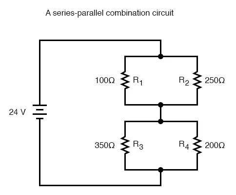

# Basic Electronics

## 1. Introduction to Electrical Circuits

### Basic Electrical Quantities and Their Units
1. Electromotive force - volts (V)
2. Current - Amperes (A)
3. Resistance - Ohms(Ω)
4. Power - Watts (W)
5. Energy - Joules (J)
6. Capacitance - Farads (F)
7. Inductance - Henrys (H)

## 2. Simple AC Circuits
## 3. Simple DC Circuits
### Passive Components
1. Resistors
2. Capacitors
3. Inductors
4. Battery

### Resistors in Series
The basic idea of a “series” connection is that components are connected end-to-end in a line to form a single path for electrons to flow.

### Resistors in Parallel
 The basic idea of a “parallel” connection, on the other hand, is that all components are connected across each other's leads.
 

 ### Series-Parallel Connection
 

### Resistivity of Metal Conductors

Electrical resistivity  is a fundamental property of a material that measures how strongly it resists electric current. A low resistivity indicates a material that readily allows electric current. Resistivity is commonly represented by the Greek letter ρ (rho). The SI unit of electrical resistivity is the ohm-meter (Ω⋅m).

Conductivity is the reciprocal of resistivity

## 4. Electronic Components

## 5. Semiconductor Theory

## 6. Memories

## 7. Number Systems

## 8. Binary Codes

## 9. Logic Gates and Boolean Algebra

## 10. Emerging Trends in Electronics