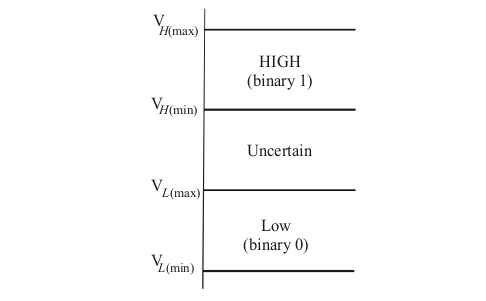

# Digital Electronics

The term *digital* represents a the method of representing numerical values, by counting digits. Digital systems are contrasted with analog systems. *Analogue systems* are those which have a continuously variable physical quantity such as spatial position, voltage, while digital systems are those which have data or signals expressed as series of the digits 0 and 1.

| Digital | Analogue     | 
|---------|--------------|
|Continuous signals| Discrete Signals |

The binary number system makes use of two digits 1 and 0. These two digits are called bits .The term bit is a contraction of binary digit. In digital circuits, two different voltage levels are used to represent the two bits. A 1 is represented by the higher voltage, which is referred to as a HIGH. On the other hand, a 0 is represented by the lower voltage and is referred to as a LOW. This is called positive logic. Thus,
    ***HIGH = 1 and LOW = 0***

### Logic Levels
The voltage used to represent bits (1 and a 0) are called logic levels. Ideally speaking, one voltage level represents a HIGH and the other voltage level represents a LOW. In a practical digital circuit, however, a HIGH can be any voltage
between a specified minimum value and a specified maximum value. Likewise, a LOW can be any voltage between a specified minimum and a specified maximum.

|  |
|:---------:|
||
|Logic Levels|

## 1. Number Systems
A number system is defined as a system of writing to express numbers. Different Number systems are needed because computers use different number systems at different stages of processing data: (1) Entry is done by the user in Decimal, (2) Storage and transmission is done in binary (3) Output can be in Decimal or Hexadecimal, etc

There are 4 commonly used number systems:
| # | Number System | Base     | 
|---|---------|--------------|
| 1 | Binary | Base 2 |
| 1 | Octal | Base 8 |
| 1 | Decimal | Base 10 |
| 1 | Hexadecimal | Base 16 |

### Place Value
Place value is the value of each digit in a number. It depends on the base

It is the position of the number *
| #\Position | 1 | 2     |  n |
|---|---------|--------------|--------------|
| Binary | Ones = 20 | Twos = 21 | ns = 2n |
| Octal | Ones = 80 | Eights = 81 | ns = 8n |
| Decimal | Ones = 100 | Tens = 101 |ns = 10n |
| Hex | Ones = 160 | Sixteens = 161 |ns = 16n |

Therefore:

**Place Value = Basei**

Where:

***i is the index of the position of the digit from the right of a whole number, counting from zero***

For Fractions, we have:
| #\Position | 1 | 2     |  n |
|---|---------|--------------|--------------|
| Binary |  2-1 | 2-2 | 2-n |
| Octal |  8-1 | 8-2 |  8-n |
| Decimal | 10-1 | 10-2 |10-n |
| Hex | 16-1 | 16-2 |16-n |

Therefore:

**Place Value = Base-i**
***i is the index of the position of the digit from the left of the fraction, counting from one***

### 1.1 Decimal
Number system in base 10.

### 1.2 Binary
Number system in base 2.

### 1.3 Binary to Other Number Systems

### 1.4 One's and Two's Complement

### 1.5 Binary Arithmetic

### 1.6 Octal

### 1.7 Octal to Other Number Systems

### 1.8 Hexadecimal

### 1.9 Hexadecimal to other number systems

### 1.10 Areas of application of Number Systems

## 2. Binary Codes

### 2.1 Importance of Binary Codes
### 2.2 Decimal Numbers in Binary Coded Decimal
### 2.3 BCD Arithmetic
### 2.4 Binary Numbers in Gray Code
### 2.5 Characters in Various Alphanumeric Codes
### 2.6 Use of Alphanumeric Codes in Digital Systems
### 2.7 Methods of Error Detection

## 3. Logic Gates and Boolean Algebra
### 3.1 Basic Logic Gates
### 3.2 Hybrid Gates
### 3.3 Boolean Algebra
### 3.4 Minimizing Logic Expressions
### 3.5 Implementing Logic Circuits

## 4. Combinational Logic Design
## 5. Logic Families
## 6. Flip Flops
## 7. Combinational Logic Circuits
## 8. Sequential Logic Circuits
## 9. Arithmetic Circuits
## 10. Converters
## 11. Memories