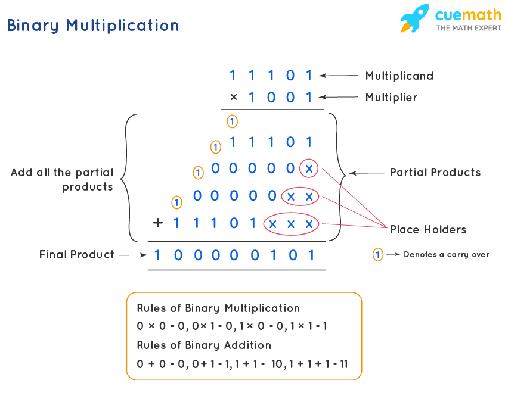
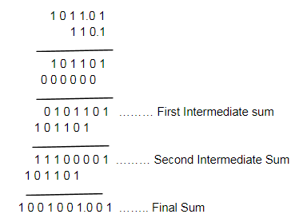

# Digital Electronics

The term *digital* represents a the method of representing numerical values, by counting digits. Digital systems are contrasted with analog systems. *Analogue systems* are those which have a continuously variable physical quantity such as spatial position, voltage, while digital systems are those which have data or signals expressed as series of the digits 0 and 1.

| Digital | Analogue     | 
|---------|--------------|
|Continuous signals| Discrete Signals |

The binary number system makes use of two digits 1 and 0. These two digits are called bits .The term bit is a contraction of binary digit. In digital circuits, two different voltage levels are used to represent the two bits. A 1 is represented by the higher voltage, which is referred to as a HIGH. On the other hand, a 0 is represented by the lower voltage and is referred to as a LOW. This is called positive logic. Thus,
    ***HIGH = 1 and LOW = 0***

### Logic Levels
The voltage used to represent bits (1 and a 0) are called logic levels. Ideally speaking, one voltage level represents a HIGH and the other voltage level represents a LOW. In a practical digital circuit, however, a HIGH can be any voltage
between a specified minimum value and a specified maximum value. Likewise, a LOW can be any voltage between a specified minimum and a specified maximum.

|  |
|:---------:|
||
|Logic Levels|

## 1. Number Systems
A number system is defined as a system of writing to express numbers. Different Number systems are needed because computers use different number systems at different stages of processing data: (1) Entry is done by the user in Decimal, (2) Storage and transmission is done in binary (3) Output can be in Decimal or Hexadecimal, etc

There are 4 commonly used number systems:

| # | Number System | Base     | 
|---|---------|--------------|
| 1 | Binary | Base 2 |
| 1 | Octal | Base 8 |
| 1 | Decimal | Base 10 |
| 1 | Hexadecimal | Base 16 |

### Place Value
In positional number systems the value of a digit depends on its position. The digital that carries the most weight is the Most Significat Digit (MSD) and that which carries the least weight is the Least Significat Digit (LSD).

Place value is weight of each digit in a number. It depends on the base

| #\Position | 1 | 2     |  n |
|---|---------|--------------|--------------|
| Binary | Ones = 20 | Twos = 21 | ns = 2n |
| Octal | Ones = 80 | Eights = 81 | ns = 8n |
| Decimal | Ones = 100 | Tens = 101 |ns = 10n |
| Hex | Ones = 160 | Sixteens = 161 |ns = 16n |

Therefore:

**Place Value = Basei**

Where:

***i is the index of the position of the digit from the right of a whole number, counting from zero***

For Fractions, we have:

| #\Position | 1 | 2     |  n |
|---|---------|--------------|--------------|
| Binary |  2-1 | 2-2 | 2-n |
| Octal |  8-1 | 8-2 |  8-n |
| Decimal | 10-1 | 10-2 |10-n |
| Hex | 16-1 | 16-2 |16-n |

Therefore:

**Place Value = Base-i**
***i is the index of the position of the digit from the left of the fraction, counting from one***

### 1.1 Decimal
Base 10. Composed of 10 numerals or symbols.

#### Decimal to Binary Conversion
There are two ways of going about this:
1. Sum of weights
2. Repeated Division by 2

#### Sum of Weights
This method makes use of binary weights. To find the binary number that is equivalent to a
given decimal number is to determine the set of binary weights whose sum is equal to the decimal number.

To work using this method:
1. Write down the powers of two whose sum is equal to the given number
2. Write down all the powers of two in order from the left upto the highest power of two in the number being converted.
3. Write 1 in the position where the power of two in the list in step 2 is also found in the powers of two in step one, and 0 otherwise.
4. The rest of step 3 is the binary number.

Example

9 = 8 + 1 => 9 = 23 + 21

|||||
|--|---|---|---|
|23|22|21|20|
|1|0|0|1|

Therefore, 910 = 10012

Exercise:
1. Convert each of the following decimal numbers to their binary equivalents using sum-of-weights methods:
- (a) 17
- (b) 24
- (c) 61
- (d) 93

2. Convert the following decimal fractions by using sum-of-weights method to their equivalent binary fraction.
- 0.375
- 0.625

#### Repeated Division by 2

##### Integer Conversion
It is a systematic way of converting integer numbers from decimal-to-binary. The procedure for conversion is as given below:
Step 1. Begin by dividing the given decimal number by 2.
Step 2. Devide each resulting quotient by 2 until there is a 0 whole number quotient.
Step 3. The remainders generated by each division form the binary number. The first remainder to be produced is the least significant bit (LSB) in the binary number, and the last remainder to be produced is the most significant bit (MSB). In other words, reading the remainders from bottom-to-top constitutes the required binary number.

Examples

1. 1910 to binary

| | | ||
|--|--|--|--|
| Number| /2 | Remainder? ||
|  19  | 9 |1|LSB|
|  9  | 4 |1||
|  4  | 2 |0||
|  2  | 1 |0|MSB|
|  1  | 0 |1|MSB|

1910 = 100112

1010

| | | ||
|-- |-- |--|--|
| Number| /2 | Remainder? ||
|  10  | 5 |0|LSB|
|  5  | 2 |1||
|  2  | 1 |0||
|  1  | 0 |1|MSB|

1010 = 10102

#### Repeated Multiplication by 2

##### Fractional Conversion
Following is the procedure that is used for conversion:
Step 1. Begin by multiplying the given decimal fraction by 2 and then multiplying each resulting fractional part of the product by 2.
Step 2. Repeat step 1 until the fractional product is zero or until the desired number of decimal places is reached.
Step 3. The carried bits or carries generated by the multiplication produce the binary number. The first carry produced is the most-significant bit (MSB) and the last carry is the least significant bit (LSB). In other words, reading from top to bottom constitutes the required fractional binary.

Examples

| | | ||
|-- |-- |--|--|
| Number| x 2 | Carry? ||
|  0.3125  | 0.625 |0|MSB|
|  0.625  | 1.25 |1||
|  0.25  | 0.5 |0||
|  0.5  | 1.0 |1|LSB|

0.312510 = 0.1012

Exercise

1. Convert the decimal fraction 0.9028 to its equivalent binary fraction (up to 4 binary places) using repeated multiplication-by-2 method.
2. Obtain the binary equivalent of 15 and 25.
3. Convert the decimal 0.8125 to its binary equivalent.

### 1.2 Binary
Number system in base 2.

### 1.3 Binary to Other Number Systems

#### Binary to Decimal Conversion
#### 1. Integer Conversion

1. Write the binary number.
2. Directly under the binary number, write the position values or weights of each bit working from right to left.
3. If a zero appears in a digit position, cross-out the weight for that position.
4. Add the remaining weights to obtain the decimal equivalent.

Example

| |  | | | | | | | |
|--| --|--|--|--|--|--|--|--|
|Step 1| 0|1|0|1|0|1|1|0|
|Step 2|27| 26|25|24|23|22|21|20|
|Step 3|~~27~~| 26|~~25~~|24|~~23~~|22|21|~~20~~|
|Step 4|0| + 26| + 0| + 24| + 0| + 22| + 21| + 0|

64 + 16 + 4 + 2 = 8610

#### 2. Fractional Conversion

Example

| |  | | | | |
|--|--|--|--|--|--|
|Step 1| 0.|1|0|1|0|
|Step 2|| 2-1|2-2|2-3|2-4|
|Step 3|| 2-1|~~2-2~~|2-3|~~2-4~~|
|Step 4|| 2-1|+ 0|+ 2-3|+ 0|

0.5 + 0.125 = 0.62510

#### Exercise

1. Convert the binary number 0.1100 to its equivalent decimal number.
2. Convert the binary number 1101.0110 to its equivalent decimal number.
3. Find the decimal forms for the two binary numbers: 11012 and 101112

### 1.4 One's and Two's Complement
Generally, there are two types of complement of Binary number: 1’s complement and 2’s complement. The 1’s complement and 2’s complement of a binary number are important because they allow us to represent the negative numbers.

#### 1's Complement
Obtaining 1’s complement of a binary number. The 1’s complement of a binary number is obtained by simply changing (or complementing) all 1s to 0s and all 0s to 1s.

Example

| MSB |--| --| --|--|--|--|LSB| |
|-- |--| --| --|--|--|--|--|--|--|
|1 | 0| 1| 1|0|0|1|0| ← Binary Number
|0 | 1| 0| 0|1|1|0|1| ← 1's Complement

The 1’s complement of 10110010 = 01001101

#### 2's Complement
The 2’s complement of a binary number is obtained by adding 1 to the LSB (least-significant bit) of the 1’s complement.

Example

|| MSB |--| --| --|--|--|--|LSB| |
|--|-- |--| --| --|--|--|--|--|--|--|
||1 | 0| 1| 1|0|0|1|0| ← Binary Number
||0 | 1| 0| 0|1|1|0|1| ← 1's Complement
|+| | | | ||||1|
||0 | 1| 0| 0|1|1|1|0| ← 2's Complement

The 2’s complement of 10110010 = 01001110

Exercise
1. Determine the 2’s complement of the following 8-bit binary numbers:
(a) 00010110
(b) 11111100
(c) 10010001

2. Obtain 2’s complement of (10111011)
3. 2’s complement of 1101010
4. Find 2’s complement of the following numbers.
(a) 01001110
(b) 01100100

### 1.5 Representing Signed Numbers
A signed number is a number which consists of both sign and magnitude information. The sign indicates whether the number is positive or negative and the magnitude is the value of the number.

There are three methods of representing signed numbers. These are:
1. The sign magnitude system
2. The 1’s complement system
3. The 2’s complement system.

#### Sign-Magnitude System
In this system, the left-most bit of a binary number is the sign-bit. The sign-bit is 0 for positive and a 1 for negative binary numbers. The magnitude bits are in true (or uncomplemented) binary for both positive and negative numbers.

Example

+ 13 = 0 1101
– 13 = 1 1101

Exercise
1. Express the decimal number – 25 as a binary number using sign-magnitude
system.

#### 1's Complement
The 1’s complement system for representing the signed numbers works as explained below:

**If a number is positive** — the sign bit is 0 and the magnitude of a binary number is represented in its true binary form.

**If a number is negative**— the sign bit is 1 and the magnitude of a binary number is represented as 1’s complement of a corresponding positive number.

For example consider the decimal number +9. Its magnitude is represented as 1001, i.e.+9=1001. When we attach a sign bit of 0, the complete signed number becomes 0(*sign bit*) 1001. However, if we consider a decimal number – 910 , it must be represented in 1’s complement form. – 9 = 1(*sign bit*) 0110

#### 2's Complement
The 2’s complement system for representing the signed numbers works as explained below:

**If a number is positive**— the sign bit is 0 and the magnitude of a binary number is represented in its true binary form.

**If a number is negative**— the sign bit is 1 and the magnitude of a binary number is represented as 2’s complement of a corresponding positive number.

For example consider the decimal number +19. Its magnitude is represented as 10011. When we attach a sign bit of 0, the complete signed number becomes 0(*sign bit*)10011. However, if we consider – 1910, it must be represented in 2’s complement form: –1910 = 1(*sign bit*) 011012

##### Conversion from Two's Complement

Use the number 0xFFFFFFFF as an example. In binary, that is:

1111 1111 1111 1111 1111 1111 1111 1111
What can we say about this number? It's first (leftmost) bit is 1, which means that this represents a number that is negative. That's just the way that things are in two's complement: a leading 1 means the number is negative, a leading 0 means the number is 0 or positive.

To see what this number is a negative of, we reverse the sign of this number. But how to do that? The class notes say (on 3.17) that to reverse the sign you simply invert the bits (0 goes to 1, and 1 to 0) and add one to the resulting number.

The inversion of that binary number is, obviously:

0000 0000 0000 0000 0000 0000 0000 0000

Then we add one.

0000 0000 0000 0000 0000 0000 0000 0001

So the negative of 0xFFFFFFFF is 0x00000001, more commonly known as 1. So 0xFFFFFFFF is -1.

Exercise

Do the following calculations using 
a) one's complement
b) two's complement

1. 12 -16
2. 16 - 12
3. 2 - 2
4. 4 - 2
5. 2 - 4

### 1.6 Binary Arithmetic

The addition of two binary numbers is performed in exactly the same manner as the addition of decimal numbers.

#### Multiplication
The process of multiplying binary numbers is similar and easier to do than decimal multiplication as binary numbers consist of only two digits which are 0 and 1. The method of multiplying binary numbers is given below. The same set of rules also apply to binary numbers with a decimal point. Let us take the example of multiplying 111012  and 10012. The decimal equivalent of 111012 is 29 and the decimal equivalent of 10012 is 9. Now let us multiply these numbers.

**Step 1**: Write down the multiplicand 111012 and the multiplier 10012  one below the other in proper positions.

**Step 2**: Multiply the rightmost digit or the least significant bit (LSB) of the multiplier (1) with all the digits of the multiplicand 111012.

**Step 3**: Add a place holder of '0' or 'X' before multiplying the next higher order digit of the multiplier& with the multiplicand.

**Step 4**: Repeat the same process for all the next higher-order digits until we reach the most significant bit (MSB) which is the left-most digit of the multiplicand with the multiplier.

**Step 5**: The product obtained in each row is called the partial product. Finally, add all the partial products. To add all the binary numbers use the rules of binary addition.

#### Fraction

#### Division

### 1.6 Octal

#### Application of Octal
When dealing with a large quantity of binary numbers of many bits, it is convenient and more efficient for us to write the numbers in octal rather than binary. However keep in mind that the digital circuits and systems work strictly in binary. We use octal numbers only as a convenience for the operators of the system.

### 1.7 Octal to Other Number Systems

1. Octal to decimal
See [Number Conversions](#Number%20Conversions)
2. Octal to Binary
See [Number Conversions](#Number%20Conversions)

3. Binary to Octal
Convert each octal digit to its binary equivalent

4. Binary to octal
Group the binary number into 3s, then convert each to its decimal equivalent.

### 1.8 Hexadecimal

### 1.9 Hexadecimal to other number systems
Conversion of Hexadecimal to binary number is a two-step process. First, we need to convert the given Hexadecimal number into its equivalent decimal number and then convert the decimal into binary.

1. Hexadecimal to decimal
See [Number Conversions](#Number%20Conversions)
2. Hexadecimal to Binary
See [Number Conversions](#Number%20Conversions)

3. Hexadecimal to Binary
The procedure for converting hexadecimal number to its binary equivalent is as follows:

Step 1. Write the hexadecimal number

Step 2. Write the 4-bit binary equivalent for each hexadecimal digit

Step 3. Check if there are any zeros on the left most position of the binary number obtained.
Drop off the zeros and write the answer as a binary number.

4. Binary to Hex
The procedure for converting hexadecimal number to its binary equivalent is as follows:

Step 1. Write the binary number.

Step 2. Starting from the right most position, group the binary number into groups of four bits. If necessary, we can add zeros at the left-most position.

Step 3. Convert each 4-bit binary group to its equivalent hexadecimal digit.

### Number Conversions
- [X] Any base to decimal (Sum of digit values)
- [X] decimal to any base (Repeated myltiplication by base/ repeated division by base)

***Excercise:***

Find out the areas fo application of Number Systems

## 2. Binary Codes

A code, in communications, is an unvarying rule for replacing a piece of information such as a letter, word, or phrase with an arbitrarily selected equivalent.

A binary code represents text, computer processor instructions, or any other data using a two-symbol system. The two-symbol system used is often "0" and "1" from the binary number system.

### 2.1 Importance of Binary Codes
Binary numbers simplify the design of computers and related technologies. Computers need many transistors to accomplish what they have to accomplish, but through binary numbers, it became easier and less expensive. It needs the least amount of necessary circuitry, which results in the least amount of space, energy consumption, and cost. It also provides safety for reliability.

The use of binary numbers increased the expressive power of the binary circuits that cut down the cost of a computer and made a more powerful computer for the same amount of money. Also, the use of binary numbers maximises the expressive power of binary circuits.

**Advantages of Binary Code:**
1. Binary codes are suitable for the computer applications.
2. Binary codes are suitable for the digital communications.
3. Binary codes make the analysis and designing of digital circuits if we use the binary codes.
4. Since only 0 & 1 are being used, implementation becomes easy.

### 2.2 Decimal Numbers in Binary Coded Decimal

BCD takes advantage of the fact that any one decimal numeral can be represented by a four-bit pattern. The most obvious way of encoding digits is Natural BCD (NBCD), where each decimal digit is represented by its corresponding four-bit binary value. This is also called "8421" encoding.

### 2.3 BCD Arithmetic

### 2.4 Binary Numbers in Gray Code

### 2.5 Characters in Various Alphanumeric Codes

### 2.6 Use of Alphanumeric Codes in Digital Systems

### 2.7 Methods of Error Detection

## 3. Logic Gates and Boolean Algebra

Logic gates are the basic building blocks for forming digital electronic circuitry. A logic gate has
one output terminal and one or more input terminals. Its output would be HIGH (1) or Low (0)
depending on the digital level (s) at the input terminal (s). The logic gates can be used to design
digital systems that will evaluate digital input levels and produce a specific output response based
on that particular logic circuit design.

Types of Logic Gates:

1. AND
2. OR
3. NOT (or INVERTER)
4. NAND
5. NOR
6. XOR (Exclusive OR)
7. Exclusive NOR

#### Truth Tables

### 3.1 Basic Logic Gates
1. NOT
2. AND
3. OR

### 3.2 Hybrid Gates

### 3.3 Boolean Algebra

### 3.4 Minimizing Logic Expressions

### 3.5 Implementing Logic Circuits

## 4. Combinational Logic Design
## 5. Logic Families
## 6. Flip Flops
## 7. Combinational Logic Circuits
## 8. Sequential Logic Circuits
## 9. Arithmetic Circuits
## 10. Converters
## 11. Memories

Resources:
http://www.ee.surrey.ac.uk/Projects/CAL/digital-logic/gatesfunc/