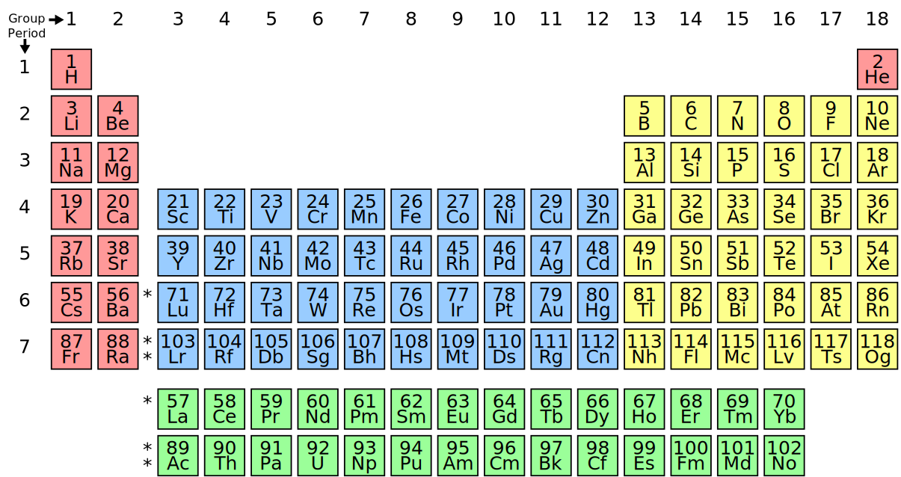

# Electronics

## 1. Semi Conductor Theory

Atomic theory is the scientific theory that matter is composed of particles called atoms. They (the atoms) are the building bricks of matter. An atom consists of:

1. A central nucleus of positive charge, around which
2. Small negative particles called electrons revolved in different paths/orbits.

The Nucleus consists of:

1. Protons  
2. Neutrons

#### 1. Atom

***An atom is the smallest particle of an element***, which can take part in a chemical reaction. If a piece of solid element like copper or zinc is ground into very tiny pieces, the smallest part of it which can take part in a chemical reaction is called an atom.

#### 2. Molecule
A molecule of a compound or element is the smallest particle of a compound or element which is capable of independent existence. A molecule may be composed of atoms of the same element or atoms of different elements.

#### 3. Ion
An ion is an electrically charged atom or group of atoms. It is formed as a result of the loss or gain of electrons. The electrons lost or gained are equal to the valence of the ions.

#### 4. Nucleus
The central positively charged particle of an atom consisting of positively charges neutrons and negatively charged neutrons.

#### 5. Neutrons
A neutron is a subatomic particle found in the nucleus of every atom except that of simple hydrogen. 

#### 6. Protons
A proton is a positively charged subatomic particle found in the nucleus of an atom.

#### 7. Electrons
A negatively charged subatomic particle that moves around the nucleus in an a
orbit.

#### 8. Orbit
A path followed by an electron as it moves around the nucleus of an atom

#### 9. Element

***An element is a pure substance consisting only of atoms that all have the same numbers of protons in their nuclei.*** Unlike chemical compounds, chemical elements cannot be broken down into simpler substances by any chemical reaction. The number of protons in the nucleus is the defining property of an element, and is referred to as its atomic number (represented by the symbol Z) – all atoms with the same atomic number are atoms of the same element

#### 10. Compound
A *chemical* compound is any substance composed of identical molecules consisting of atoms of two or more chemical elements. That is, as we go down a list of elements in order of atomic weights, corresponding properties are observed at regular intervals. 

#### 11. Periodic Table
*The periodic law* states that when the elements are listed in order of increasing atomic weights, their properties vary periodically. 

*The periodic table* is an arrangement of all the elements known to man in accordance with their increasing atomic number and recurring chemical properties, so that elements with similar atomic structure (and hence similar chemical properties) appear in vertical columns. That is, each vertical column of the periodic table contains a group or family of related elements. 

### Classification of Materials
The molecules arrangement in solids, liquids, and gases are not the same. In gaseous substances, the arrangement of molecules  are spread apart and are not so close to each other. In liquids, the molecules are closer to each other. But, in solids, the molecules are closely arranged together, due to this the electrons within the molecule atoms move into the neighboring atoms orbital. 

According to the theory of energy band, the energy bands are classified into three types which include the following:
- Valence band
- Forbidden energy gap
- Conduction band

#### Valence Band
The electrons which are present within the outer shell are named as valance Electrons. These electrons include a sequence of energy levels which form an energy band named as valence band. This band includes the maximum occupied energy.

#### Conduction Band
The conduction band is the band of electron orbitals that electrons can bounce up into from the valence band when energized. At the point when the electrons are in these orbitals, they have enough energy to move freely in the material. This movement of electrons makes an electric current flow. The valence band is the furthest electron orbital of a particle of a particular material that electrons involve.

#### Forbidden Energy Gap
The forbidden gap is the gap between the conduction band and the valence band. This band is forbidden one without energy. Therefore there is no electron flow in this band. The flow of electrons from the valence to conduction will pass through this gap.

Band theory models the behaviour of electrons ***in solids*** by postulating the existence of energy bands. It successfully uses a material’s band structure to explain many physical properties of solids.

Based on the ability of various materials to conduct current, the materials are classified as conductors, insulators and the semiconductors.

A metal which is very good carrier of electricity is called conductor. Copper and aluminium
are good examples of conductors.

A very poor conductor of electricity is termed as insulator. Glass, wood, mica, diamond are the
examples of insulators.

A material having conductivity which is between conductor and an insulator is called a semiconductor. Silicon and germanium are the examples of semiconductors. They not conduct current at low temperatures but as temperature increases these materials behave as good conductors.

#### 1. Conductors
In the metals like copper, aluminium there is no forbidden gap between valence band and
conduction band. The two bands overlap. Hence even at room temperature, a large number of electrons are available for conduction. So without any additional energy, such metals contain a large number of free electrons and hence called good conductors.

#### 2. Insulators
In insulators, there exists a large forbidden gap in between the conduction band and the valence band.
Practically it is impossible for an electron to jump from the valence band to the conduction band. Hence such materials cannot conduct and called insulators.

A forbidden gap which is very wide, approximately of about 7eV is present in insulators. For a
diamond, which is an insulator, the forbidden gap is about 6eV.

Such materials may conduct only at very high temperatures or if they are subjected to high voltage. Such conduction is rare and is called breakdown of an insulator. (All insulating materials undergo breakdown when the electric field caused by an applied voltage exceeds the material's dielectric strength.)

#### 3. Semi-Conductors

In semi-conductors, the forbidden gap is very narrow, about 1ev. In such materials, the energy provided by the heat at room temperature is sufficient to lift the electrons from the valence band to the conduction band. The forbidden gap of Ge is 0.72eV and Si is 1.1eV.

The semiconductor is divided into two types. One is Intrinsic Semiconductor and other is an Extrinsic semiconductor. The pure form of the semiconductor is known as the intrinsic semiconductor and the semiconductor in which intentionally impurities is added for making it conductive is known as the extrinsic semiconductor.

#### 1. Intrinsic Semi-Conductors

An extremely pure semiconductor is called Intrinsic Semiconductor. On the basis of the energy band phenomenon, an intrinsic semiconductor at absolute zero temperature is shown below:

Its valence band is completely filled and the conduction band is completely empty. When the temperature is raised and some heat energy is supplied to it, some of the valence electrons are lifted to conduction band leaving behind holes in the valence band as shown below:

intrinsic-semiconductor-and-extrinsic-semiconductor-figure-2The electrons reaching at the conduction band move randomly. The holes created in the crystal also free to move anywhere. This behaviour of the semiconductor shows that they have a negative temperature coefficient of resistance.

This means that with the increase in temperature, the resistivity of the material decreases and the conductivity increases.

#### 2. Silicon
Z=14
#### 3. Germanium
Z=32

#### 4. Covalent Bonds
A covalent bond consists of the mutual sharing of one or more ***pairs*** of electrons between two atoms. These electrons are simultaneously attracted by the two atomic nuclei.

The figure above (a) shows four electrons in the valence shell of a semiconductor forming covalent bonds(pairs of shared electrons) to four other atoms. Electrons are not free to move about the crystal lattice. Thus, intrinsic, pure, semiconductors are relatively good insulators as compared to metals.

Thermal energy may occasionally free an electron from the crystal lattice as in Figure above (b). This electron is free for conduction about the crystal lattice. When the electron was freed, it left an empty spot with a positive charge in the crystal lattice known as a hole. This hole is not fixed to the lattice; but, is free to move about. The free electron and hole both contribute to conduction about the crystal lattice. That is, the electron is free until it falls into a hole. This is called recombination. 

#### 5. Electron-hole pair generation/recombination

Carrier generation and carrier recombination are processes by which mobile charge carriers (electrons and electron holes) are created and eliminated.

Generation of electron is a transition from the valence band to the conduction band and recombination leads to a reverse transition.

When energy is supplied to a semiconductor, a valence electron is lifted to a higher energy level, going into the conduction band, the departing electron leaves a vacancy in the valence band. This vacancy is known as an electron ***hole***. The hole acts as a positive charge. 

If only one electron is lifted to the conduction band, then one hole is created in the valence band, thus, each time an electron-hole pair is formed. 

The one atom of the conduction band orbit may intersect with the hole orbit of another atom. As a result of this intersection, the conduction band electron falls into a hole. This merging of the free electron and a hole is called Recombination of Electron and Hole. When the recombination takes place, the hole does not move anywhere, it just disappears.

This recombination process takes place continuously in a semiconductor and fills every hole. However, the incoming heat energy keeps producing new holes by lifting valence electrons up to the conduction band forming electron-hole pair. The creation of electron-hole pairs and their recombination goes on continuously.

The average timing between the creation and the disappearing of an electron-hole pair is termed as Lifetime. The lifetime varies from nanoseconds to several microseconds depending upon the various factors such as shape, size, crystal structure of the semiconductor material.

### Extrinsic Semi-Conductors

A semiconductor to which an impurity at a controlled rate is added to make it conductive is known as an extrinsic semiconductor.

If a Pentavalent impurity, having five valence electrons is added to a pure semiconductor a large number of free electrons will exist.

If a trivalent impurity having three valence electrons is added, a large number of holes will exist in the semiconductor.

Depending upon the type of impurity added the extrinsic semiconductor may be classified as n type semiconductor and p type semiconductor.

1. Doping
The process by which an impurity is added to a semiconductor is known as Doping.
The purpose of adding impurity in the semiconductor crystal is to increase the number of free electrons or holes to make it conductive.  

2. N-type semiconductor
It is possible to increase the number of negative charge carriers within the semiconductor crystal lattice by doping with an electron donor like Phosphorus. Electron donors, also known as N-type dopants include elements from group VA ( Group 15 ) of the periodic table: nitrogen, phosphorus, arsenic, and antimony. Phosphorus, arsenic, and antimony are used with silicon.

3. P-type Semiconductor
It is also possible to introduce an impurity lacking an electron as compared with silicon, having three electrons in the valence shell as compared with four for silicon. This leaves an empty spot known as a hole, a positive charge carrier. The boron atom tries to bond to four silicon atoms, but only has three electrons in the valence band. In attempting to form four covalent bonds the three electrons move around trying to form four bonds. This makes the hole appear to move. Furthermore, the trivalent atom may borrow an electron from an adjacent (or more distant) silicon atom to form four covalent bonds. However, this leaves the silicon atom deficient by one electron. In other words, the hole has moved to an adjacent (or more distant) silicon atom.

Doping with an electron acceptor, an atom which may accept an electron, creates a deficiency of electrons, the same as an excess of holes. Since holes are positive charge carriers, an electron acceptor dopant is also known as a P-type dopant.

The P-type elements from group IIIA of the periodic table include boron, aluminum, gallium, and indium. Boron is used as a P-type dopant for silicon and diamond semiconductors, while indium is used with germanium.

4. Intrinsic Conduction
The conduction of intrinsic semiconductors which is temperature dependent.

5. Extrinsic Conduction
The conduction of extrinsic semiconductors which is not temperature dependent due to the introduction of more charge carriers by the dopant.

### The P-N Junctions
1. Formation of the Junction
a single semiconductor crystal manufactured with P-type material at one end and N-type material at the other in Figure below (b) has some unique properties. The P-type material has positive majority charge carriers, holes, which are free to move about the crystal lattice. The N-type material has mobile negative majority carriers, electrons. Near the junction, the N-type material electrons diffuse across the junction, combining with holes in P-type material. The region of the P-type material near the junction takes on a net negative charge because of the electrons attracted. Since electrons departed the N-type region, it takes on a localized positive charge.

2. Depletion Layer
In the PN junction, The thin layer of the crystal lattice between these charges has been depleted of majority carriers, thus, is known as the depletion layer. It becomes nonconductive intrinsic semiconductor material. In effect, we have nearly an insulator separating the conductive P and N doped regions.

This separation of charges at the PN junction constitutes a potential barrier. This potential barrier must be overcome by an external voltage source to make the junction conduct. The formation of the junction and potential barrier happens during the manufacturing process. The magnitude of the potential barrier is a function of the materials used in manufacturing. Silicon PN junctions have a higher potential barrier than germanium junctions.

3. Forward Bias

In Figure below(a) the battery is arranged so that the negative terminal supplies electrons to the N-type material. These electrons diffuse toward the junction. The positive terminal removes electrons from the P-type semiconductor, creating holes that diffuse toward the junction. If the battery voltage is great enough to overcome the junction potential (0.6V in Si), the N-type electrons and P-holes combine annihilating each other. This frees up space within the lattice for more carriers to flow toward the junction. Thus, currents of N-type and P-type majority carriers flow toward the junction. The recombination at the junction allows battery current to flow through the PN junction diode. Such a junction is said to be forward-biased.

If the battery polarity is reversed as in Figure above(b) majority carriers are attracted away from the junction toward the battery terminals. The positive battery terminal attracts N-type majority carriers, electrons, away from the junction. The negative terminal attracts P-type majority carriers, holes, away from the junction. This increases the thickness of the nonconducting depletion region. There is no recombination of majority carriers; thus, no conduction. This arrangement of battery polarity is called reverse bias.

### Excercise
1. Explain atomic theory
2. Classify materials using the energy band diagram
3. Describe extrinsic semiconductors
4. Describe the PN junction

### Practice
#### 1. Identification of Terminals of A P-N Junction Diode
It is easy to determine the polarity of many wired diodes. The "bar" on the circuit symbol corresponds to the cathode of the diode and this is often marked by a white line around the circumference of the actual diode.

#### Determining Polarity Using Digital Multimeter
[Notes](https://www.electronicshub.org/test-a-diode/)

- [Identifying Terminals Using Digital Multimeter](https://www.youtube.com/watch?v=gzh8ICLMXzQ&ab_channel=NesoAcademy)
- [Test if a diode is working](https://www.youtube.com/watch?v=Rj9WpoaX2Gk&ab_channel=CircuitDigest)

***Notes:***
When a diode is forward biased, it should have a voltage drop of 0.5 - 0.7 Volts, otherwise the diode is damaged.

#### 2. Connection of a Diode in a Circuit
For a current to flow across the PN diode junction it must be forward biased. Under these conditions conventional current flows from the anode to the cathode, but not the other way around.

When a PN junction diode is forward biased, the anode is positive with respect to the cathode, and conversely, when reverse biased the cathode is positive with respect to the anode.

#### 3. Characteristics of a P-N Junction Diode

[Chapter Notes](https://www.electronics-notes.com/articles/electronic_components/diode/pn-junction-diode.php)

Notes
1. https://energyeducation.ca/encyclopedia/Valence_band
2. https://energyeducation.ca/encyclopedia/Conduction_band
3. https://circuitglobe.com/electron-hole-pairs-generation-and-recombination.html
4. https://chem.libretexts.org/Bookshelves/Physical_and_Theoretical_Chemistry_Textbook_Maps/Supplemental_Modules_(Physical_and_Theoretical_Chemistry)/Atomic_Theory/Atomic_Theory
5. https://byjus.com/physics/intrinsic-semiconductors/
6. https://circuitglobe.com/intrinsic-semiconductor-and-extrinsic-semiconductor.html
7. https://www.mrsd.org/cms/lib/NH01912397/Centricity/Domain/245/atoms%20and%20periodic%20table%20notes.pdf
8. https://www.unf.edu/~michael.lufaso/chem2045/Chapter2.pdf