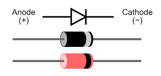

# Electronics

## 1. Semi Conductor Theory

Atomic theory is the scientific theory that matter is composed of particles called atoms. They (the atoms) are the building bricks of matter. An atom consists of:

1. A central nucleus of positive charge, around which
2. Small negative particles called electrons revolved in different paths/orbits.

The Nucleus consists of:

1. Protons  
2. Neutrons

#### 1. Atom

***An atom is the smallest particle of an element***, which can take part in a chemical reaction. If a piece of solid element like copper or zinc is ground into very tiny pieces, the smallest part of it which can take part in a chemical reaction is called an atom.

#### 2. Molecule
A molecule of a compound or element is the smallest particle of a compound or element which is capable of independent existence. A molecule may be composed of atoms of the same element or atoms of different elements.

#### 3. Ion
An ion is an electrically charged atom or group of atoms. It is formed as a result of the loss or gain of electrons. The electrons lost or gained are equal to the valence of the ions.

#### 4. Nucleus
The central positively charged particle of an atom consisting of positively charges neutrons and negatively charged neutrons.

#### 5. Neutrons
A neutron is a subatomic particle found in the nucleus of every atom except that of simple hydrogen. 

#### 6. Protons
A proton is a positively charged subatomic particle found in the nucleus of an atom.

#### 7. Electrons
A negatively charged subatomic particle that moves around the nucleus in an a
orbit.

#### 8. Orbit
A path followed by an electron as it moves around the nucleus of an atom

#### 9. Element

***An element is a pure substance consisting only of atoms that all have the same numbers of protons in their nuclei.*** Unlike chemical compounds, chemical elements cannot be broken down into simpler substances by any chemical reaction. The number of protons in the nucleus is the defining property of an element, and is referred to as its atomic number (represented by the symbol Z) – all atoms with the same atomic number are atoms of the same element

#### 10. Compound
A *chemical* compound is any substance composed of identical molecules consisting of atoms of two or more chemical elements. That is, as we go down a list of elements in order of atomic weights, corresponding properties are observed at regular intervals. 

#### 11. Periodic Table
*The periodic law* states that when the elements are listed in order of increasing atomic weights, their properties vary periodically.

Each vertical column of the periodic table contains a group or family of related elements. 

### Classification of Materials
#### 1. Insulators
#### 2. Conductors
#### 3. Semi-Conductors

The semiconductor is divided into two types. One is Intrinsic Semiconductor and other is an Extrinsic semiconductor. The pure form of the semiconductor is known as the intrinsic semiconductor and the semiconductor in which intentionally impurities is added for making it conductive is known as the extrinsic semiconductor.

#### 1. Intrinsic Semi-Conductors

An extremely pure semiconductor is called Intrinsic Semiconductor. On the basis of the energy band phenomenon, an intrinsic semiconductor at absolute zero temperature is shown below:

Its valence band is completely filled and the conduction band is completely empty. When the temperature is raised and some heat energy is supplied to it, some of the valence electrons are lifted to conduction band leaving behind holes in the valence band as shown below:

intrinsic-semiconductor-and-extrinsic-semiconductor-figure-2The electrons reaching at the conduction band move randomly. The holes created in the crystal also free to move anywhere. This behaviour of the semiconductor shows that they have a negative temperature coefficient of resistance.

This means that with the increase in temperature, the resistivity of the material decreases and the conductivity increases.

#### 2. Silicon
Z=14
#### 3. Germanium
Z=32

#### 4. Covalent Bonds
A covalent bond consists of the mutual sharing of one or more ***pairs*** of electrons between two atoms. These electrons are simultaneously attracted by the two atomic nuclei.

#### 5. Electron-hole pair generation/recombination

### Extrinsic Semi-Conductors

A semiconductor to which an impurity at a controlled rate is added to make it conductive is known as an extrinsic semiconductor.

If a Pentavalent impurity, having five valence electrons is added to a pure semiconductor a large number of free electrons will exist.

If a trivalent impurity having three valence electrons is added, a large number of holes will exist in the semiconductor.

Depending upon the type of impurity added the extrinsic semiconductor may be classified as n type semiconductor and p type semiconductor.

1. Doping
The process by which an impurity is added to a semiconductor is known as Doping.
The purpose of adding impurity in the semiconductor crystal is to increase the number of free electrons or holes to make it conductive.  

2. N-type semiconductor

3. P-type Semiconductor

4. Extrinsic Conduction

### The P-N Junctions
1. Formation of the Junction
2. Depletion Layer
3. Forward Bias

### Practice
#### 1. Identification of Terminals of A P-N Junction Diode
It is easy to determine the polarity of many wired diodes. The "bar" on the circuit symbol corresponds to the cathode of the diode and this is often marked by a white line around the circumference of the actual diode.

#### Determining Polarity Using Digital Multimeter
[Notes](https://www.electronicshub.org/test-a-diode/)

- [Identifying Terminals Using Digital Multimeter](https://www.youtube.com/watch?v=gzh8ICLMXzQ&ab_channel=NesoAcademy)
- [Test if a diode is working](https://www.youtube.com/watch?v=Rj9WpoaX2Gk&ab_channel=CircuitDigest)

***Notes:***
When a diode is forward biased, it should have a voltage drop of 0.5 - 0.7 Volts, otherwise the diode is damaged.

#### 2. Connection of a Diode in a Circuit
For a current to flow across the PN diode junction it must be forward biased. Under these conditions conventional current flows from the anode to the cathode, but not the other way around.

When a PN junction diode is forward biased, the anode is positive with respect to the cathode, and conversely, when reverse biased the cathode is positive with respect to the anode.

#### 3. Characteristics of a P-N Junction Diode

[Chapter Notes](https://www.electronics-notes.com/articles/electronic_components/diode/pn-junction-diode.php)

Notes
1. https://energyeducation.ca/encyclopedia/Valence_band
2. https://energyeducation.ca/encyclopedia/Conduction_band
3. https://circuitglobe.com/electron-hole-pairs-generation-and-recombination.html
4. https://chem.libretexts.org/Bookshelves/Physical_and_Theoretical_Chemistry_Textbook_Maps/Supplemental_Modules_(Physical_and_Theoretical_Chemistry)/Atomic_Theory/Atomic_Theory
5. https://byjus.com/physics/intrinsic-semiconductors/
6. https://circuitglobe.com/intrinsic-semiconductor-and-extrinsic-semiconductor.html
7. https://www.mrsd.org/cms/lib/NH01912397/Centricity/Domain/245/atoms%20and%20periodic%20table%20notes.pdf
8. https://www.unf.edu/~michael.lufaso/chem2045/Chapter2.pdf