# Industrial PLC

## Introduction to PLCs
PLC stands for programmable logic controller, and can loosely be defined as *a solid-state computer that monitors both inputs and outputs of automated processes in a manufacture chain, making logic-based decisions based on inputs received.*

The PLC performs the logic functions of relays, timers, counters and sequencers. It has the following advantages:

Programming the PLC is easier than wiring the relay control panel.

1. The PLC can be reprogrammed. Conventional controls must be rewired and are often scrapped instead.
2. PLCs take less floor space then relay control panels.
3. Maintenance of the PLC is easier, and reliability is greater.
4. The PLC can be connected to the plant computer systems more easily than relays can.

### Parts of a PLC

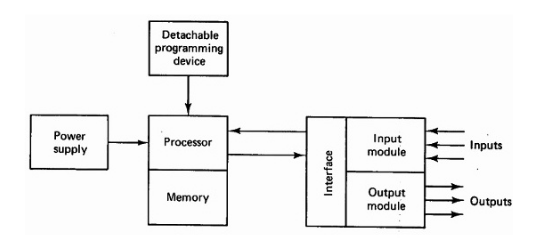

There are 5 major components, the 6th being the external programming device:
1. CPU (Central processing unit) - which is the brain of the device
2. Memory
3. Input module
4. Output Module
5. Power Supply
6. External Programming Device

The components are housed in a suitable cabinet designed for the industrial environment.

The input module and output module are the connections to the industrial process that need to be controlled. The inputs to the controller are signals from *limit switches, push-buttons, sensors, and
other on-off devices.* In addition, larger PLCs are capable of accepting signals from analogue devices of the type modelled. The outputs from the controller are *on-off signals* to operate motors, valves, and other devices required to actuate the process.

The processor is the central processing unit (CPU) of the programmable controller. It executes the various logic and sequencing functions described in previous Sections by operating on the PLC INPUTS TO DETERMINE THE APPROPRIATE OUTPUT SIGNALS. The processor is normally a 16 or 32-bit a microprocessor.

Tied to the CPU is the PLC memory, which contains the program of logic, sequencing, and other input/output operations. The memory for a programmable logic controller is specified in the same way as for a computer, and may range from 1k to over 48k of storage capacity.

A power supply is specially used to drive the PLC even though the components of the industrial process that are regulated may have a higher voltage and power rating than the controller itself.

The PLC is programmed by means of a programming device. The programming device (sometimes referred to as a programmer) is usually detachable from the PLC cabinet so that it can be shared between different controllers.

### Common Uses of a PLC
1. Industrial automation
2. Prepaid electricity meters
3. Washing machines
4. Elevators
5. Traffic signals

## Types of Industrial Software Systems

## Industrial Communication Network

### Networks
Communication networks may be used in control systems to pass data between (1) field devices and PLCs, (2) between different PLCs, or (3) between PLCs and personal computers used for operator interface, data processing and storage, or management information.

Although a communications circuit can involve only two pieces of equipment with a circuit between them, the term network typically refers to connecting many devices together to permit the sharing of data between devices over a single (or redundant) circuits.

Data is transmitted over a network using serial communication, in which words of data called bytes consisting of individual logical zeros and ones (bits) are transmitted sequentially from one device to another.

The collection of data in a single transmission is often called a packet. The rate at which data can be transmitted over a network is defined in bits-per-second or bps, but typically expressed in thousands (Kbps) or millions (Mbps).

### Industrial Networks

In large SCADA systems, there is usually a communications network of some type connecting the individual PLCs to the operator interface equipment at the central control room.

#### Typical Networks
Two terms that are commonly used with respect to management information systems communication are local area network (LAN) and wide area network (WAN). 

#### LAN (Local Area Network)
A LAN consists of all of the devices, typically PCs and servers within a particular industrial facility or site.

#### WAN (Wide Area Network)
A WAN is created by providing a connection between LANs, typically over a long geographic distance using telecommunications industrial facilities. 

#### Network Physical Layer Wiring
All communications networks utilize one of two media to transmit data signals between devices: 

(1) Electrical conductors such as copper wire or 
(2) optical conductors such as fiber optic cable 

Wireless communication via radio or microwave radiation does not require an intervening medium

The point on a device at which the circuit is connected is referred to as a communications port; the physical and electrical characteristics of the communications port must match the media to be used for the network.

#### Copper Cables
Copper media will support either (1) point-to-point or (2) tapped network configurations. Copper-based networks may be used between devices and PLCs or between PLCs, but should not be installed over long distances, or across an industrial facility boundary. All copper network cables should be of shielded construction.

For copper-based networks, three basic types of copper conductors are used.

#### 1. Shielded Twisted pair (STP)

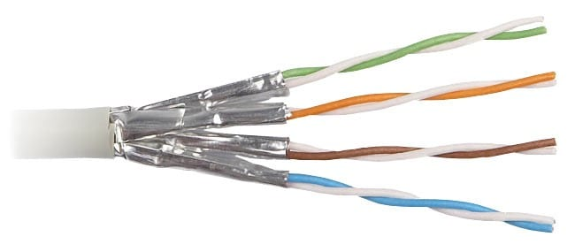
Shielded twisted pair (STP), in which individual pairs of insulated conductors are twisted together to reduce inductively coupled interference and covered with a continuous metallic foil shield to reduce capacitively coupled interference.

Individual pairs or multiple pairs are then assembled into a cable within an overall jacket that provides environmental protection.

#### 2. Unshielded Twisted pair (UTP)
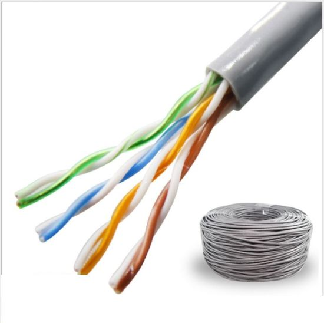

Unshielded twisted pair (UTP), have individual pairs of insulated conductors that are twisted together to reduce inductively coupled interference.

Individual pairs or multiple pairs are then assembled into a cable with an overall jacket to provide environmental protection.

#### 3. Co-axial
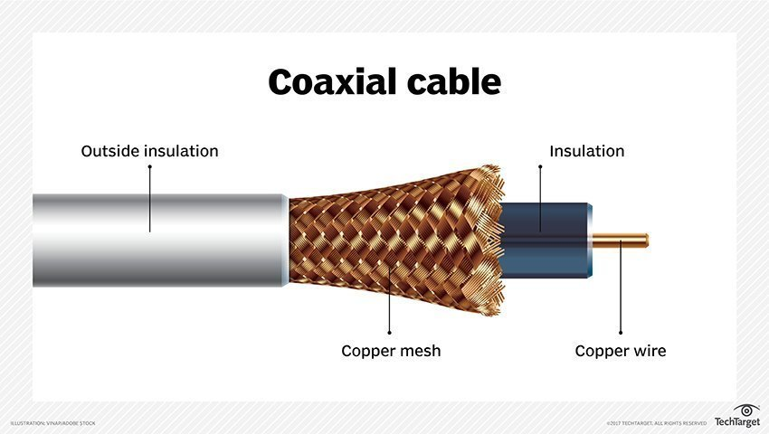
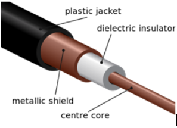
Coaxial cables have concentric layers of electrical conductors and insulating material. This construction ensures signals are enclosed within the cable and prevents electrical noise from interfering with the signal.

Configurations are available with multiple coaxial cables within a common overall jacket; these are often referred to as twin-ax (2 cables) or tri-ax (3 cables). Coaxial cable construction is inherently shielded.

#### CAT5 & CAT6
CAT5 cable is made up of four twisted pairs of copper wire. Can handle up to 10/100 Mbps at a 100 MHz bandwidth.

A CAT6 cable is similar to a Cat5 ethernet cable — it consists of four pairs of twisted copper wire. However, it provides much more functionality. A Cat6 cable has a bandwidth capacity of 250 MHz, for example, and it offers speeds of up to 10 Gbps. 

#### Fiber Networks

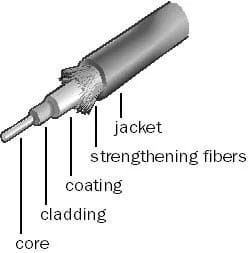
Fiber-Optic cabling is a glass cabling media that sends network signals using light. Fiber-optic cabling has higher bandwidth capacity than copper cabling.

Fiber-optic cabling consists of a signal-carrying glass core of 5 to 100 microns in diameter (a sheet of paper is about 25 microns thick and a human hair about 75 microns thick), surrounded by a layer of pure silica called cladding, which prevents light from escaping.

Surrounding the cladding are protective layers of acrylic plastic coating, Kevlar fibers for additional strength, and a PVC (polyvinyl chloride) jacket.

Network components use LED or laser diodes to convert electrical signals into light pulses for transmission on fiber-optic cables. An optical detector is used to convert the light pulses back into electrical signals.

There are two types of fiber-optic cabling:

1. Single-mode fiber-optic cabling: 
Has a narrow core (5 or 10 microns in diameter) and allows only one signal to be sent or received at a time over very long distances (up to 50 times farther than multimode fiber-optic cabling). Single-mode fiber-optic cabling uses laser-emitting diodes to introduce signals into the fiber and can transmit only one signal (light beam) at a time. Signal transmission is clear for approximately 30 miles (50 kilometers) before dispersion will distort signals, which means that single-mode fiber is ideal for long cable runs. 

2. Multimode fiber-optic cabling: 
Has a thicker core (50, 62.5, or 100 microns in diameter) and has sufficient bandwidth to allow multiple signals to be simultaneously transmitted or received; each signal follows a different path or mode through the fiber. Light-emitting diodes are used instead of laser-emitting diodes to introduce signals into multimode fiber. Signal transmission is clear for approximately 3000 feet, but longer cable runs can distort signals through modal dispersion. 

There are two types of multimode fiber: 
1. Step-index multimode fiber: The less costly variety of multimode fiber, it uses a wide core with a uniform index of refraction, causing the light beams to reflect in mirror fashion off the inside surface of the core by the process of total internal reflection. Because light can take many different paths down the cable and each path takes a different amount of time, signal distortion can result when step-index fiber is used for long cable runs.
2. Graded-index multimode fiber: The more expensive type of multimode fiber, it uses a core made of multiple concentric layers of glass, each having a lower index of refraction than the layer it contains. In graded-index fiber, light beams follow curved paths and all rays reach the end of the fiber simultaneously, reducing the signal distortion that occurs in step-index fiber when long cable runs are used. 

### Transmission Mode
Transmission mode means transferring data between two devices. It is also known as a communication mode. Buses and networks are designed to allow communication to occur between individual devices that are interconnected. There are three types of transmission mode:- 

#### 1. Simplex (Simple Mode)

In Simplex mode, the communication is unidirectional. Only one of the two devices on a link can transmit, the other can only receive. The simplex mode can use the entire capacity of the channel to send data in one direction. 
Example: Keyboard and traditional monitors. The keyboard can only introduce input, the monitor can only give the output. 

#### 2. Half Duplex

Half-duplex devices can only transmit in one direction at one time. With half-duplex mode, data can move in two directions, but not at the same time.

#### 3. Full Duplex

The term full-duplex describes simultaneous data transmission and receptions over one channel. A full-duplex device is capable of bi-directional network data transmissions at the same time.

### Network Design
let students refer to class notes.

#### Topology
#### Ring
#### Star
#### Bus

### Protocols

#### Ethernet
Ethernet protocol is a typical LAN technology. Standard Ethernet-based local area networks transmit data at speed up to 10 Mbps. New Ethernet cards known as Fast Ethernet represent high-speed LAN technology as it can provide data transfer rates as high as 100 Mbps.

### Serial Communication
In telecommunication, the process of sending data sequentially over a computer bus is called as serial communication, which means the data will be transmitted bit by bit. While in parallel communication the data is transmitted in a byte (8 bit) or character on several data lines or buses at a time. Serial communication is slower than parallel communication but used for long data transmission due to lower cost and practical reasons.

Serial communication
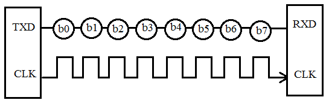

Parallel communication
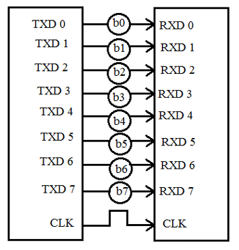

**Modes of Data Transfer in Serial Communication:**

1. **Asynchronous Data Transfer** – The mode in which the bits of data are not synchronized by a clock pulse. Clock pulse is a signal used for synchronization of operation in an electronic system.
2. **Synchronous Data Transfer** – The mode in which the bits of data are synchronized by a clock pulse.

**Characteristics of Serial Communication:**

1. **Baud rate** is used to measure the speed of transmission. It is described as the number of bits passing in one second. For example, if the baud rate is 200 then 200 bits per Sec passed. In telephone lines, the baud rates will be 14400, 28800 and 33600.

In the serial port context, "9600 baud" means that the serial port is capable of transferring a maximum of 9600 bits per second.
2. **Start Bit**: The start bit is used to signal the beginning of a frame.  Both transmitter and receiver assume that the channel is initially idle (i.e. zero volt logical level). The beginning of a frame is then signalled by setting the channel high for a specified length of time and then setting it low again. Transmission of data bits usually commences a specified interval of time after the falling edge of the start bit.
3. **Stop Bits** are used for a single packet to indicate the end of the packet.
4. **Parity Bit** is the simplest form of checking the errors. There are of four kinds, i.e., even odd, marked and spaced. For example, If 011 is a number the parity bit=0, i.e., even parity and the parity=1, i.e., odd parity.

Timing Diagram for Serial protocol
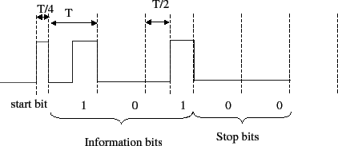

#### RS485
RS-485 is an industrial specification that defines the electrical interface and physical layer for point-to-point communication of electrical devices. RS-485 and RS-422 are serial interface standards in which data is sent in a differential pair (two wires, or twisted pair cable), which allows greater distances and higher data rates than non-differential serial schemes such as RS-232

Most electrical signals are single-ended, comprised of a single wire and ground. Differential signals use two wires which are the inverse of each other -- when one swings positive, the other swings negative in equal magnitude. The receiving circuit looks only at the difference between the two, ignoring any common-mode voltage. This "push-pull" arrangement reduces the impact of electrical interference because external noise will affect both wires equally and the common-mode rejection will ignore the noise.

#### RS232
The term RS232 stands for "Recommended Standard 232" and it is a type of serial communication used for transmission of data normally in medium distances.

In telecommunication, the process of sending data sequentially over a computer bus is called as serial communication, which means the data will be transmitted bit by bit. While in parallel communication the data is transmitted in a byte (8 bit) or character on several data lines or buses at a time. Serial communication is slower than parallel communication but used for long data transmission due to lower cost and practical reasons.

#### Field bus
Let students find out about this.

#### HART
Let students find out about this.

### Physical Industrial Networks

### Network Devices
#### Modems
A modem is a computer hardware device that converts data from a digital format into a format suitable for an analog transmission medium such as telephone or radio. A modem transmits data by modulating one or more carrier wave signals to encode digital information, while the receiver demodulates the signal to recreate the original digital information. The goal is to produce a signal that can be transmitted easily and decoded reliably. Modems can be used with almost any means of transmitting analog signals, from light-emitting diodes to radio.

#### Network Switches
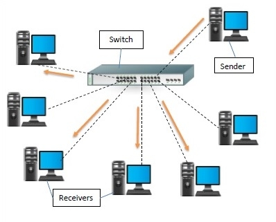
A switch is a data link layer device in a computer network that connects other devices together. Multiple data cables are plugged into a switch to enable communication between different networked devices. Switches manage the flow of data across a network by transmitting a received network packet only to the one or more devices for which the packet is intended. Each networked device connected to a switch can be identified by its network address, allowing the switch to direct the flow of traffic maximizing the security and efficiency of the network.

They use MAC addresses to forward data at the data link layer (layer 2) of the OSI model. Some switches can also forward data at the network layer (layer 3) by additionally incorporating routing functionality. 

A switch is more intelligent than an Ethernet hub, which simply retransmits packets out of every port of the hub except the port on which the packet was received, unable to distinguish different recipients, and achieving an overall lower network efficiency.

#### Network hubs
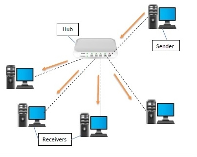
A hub is a physical layer networking device which is used to connect multiple devices in a network. They are generally used to connect computers in a LAN. When a data frame arrives at a port, it is broadcast to every other (except the port from which the data is received) port, without considering whether it is destined for a particular destination or not.

#### Network bridges
A network bridge is a computer networking device that creates a single, aggregate network from multiple communication networks or network segments. This function is called network bridging.[1] Bridging is distinct from routing. Routing allows multiple networks to communicate independently and yet remain separate, whereas bridging connects two separate networks as if they were a single network.[2] In the OSI model, bridging is performed in the data link layer (layer 2).[3] If one or more segments of the bridged network are wireless, the device is known as a wireless bridge.

#### Router
A router is a networking device that forwards data packets between computer networks. Routers perform the traffic directing functions on the Internet. Data sent through the internet, such as a web page or email, is in the form of data packets. A packet is typically forwarded from one router to another router through the networks that constitute an internetwork (e.g. the Internet) until it reaches its destination node.

#### Terminal Reflectors
Let students find out about this.

#### Signal Amplifiers
Let students find out about this.
